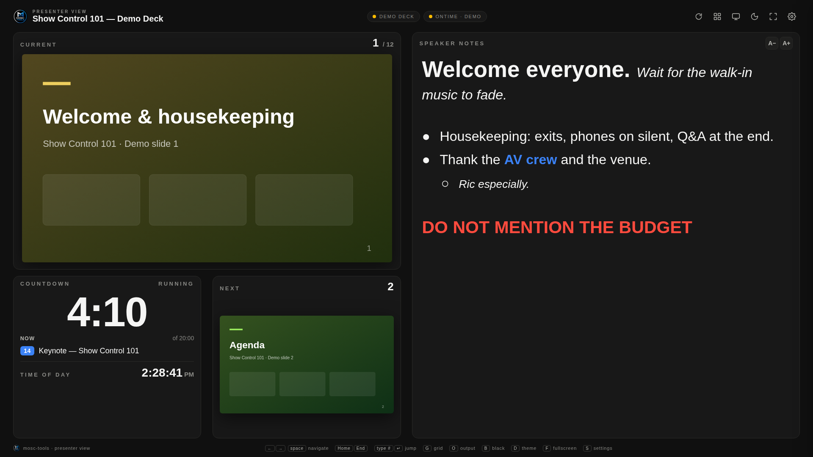
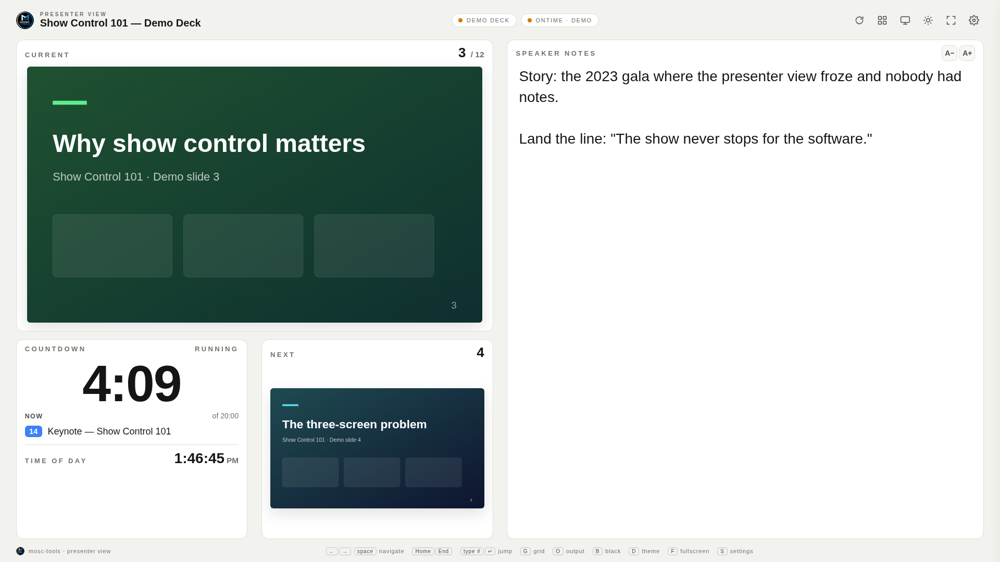

# Mosc-tools — Presenter View for Google Slides + Ontime

A fullscreen, custom presenter view for Google Slides that adds what Google's own view can't give you:
an Ontime countdown, a confidence monitor that can live on any machine on the show network,
and a dark/light theme. One HTML file. No install, no build. Double-click and go.

```
Mosc-tools--Presenter-View.html   ← the whole app
bridge/Code.gs                    ← small Apps Script that reads private decks as you
```

Hosted copy: [moscone.ca/sheetspresenter.html](https://moscone.ca/sheetspresenter.html) (Ontime Cloud only — see Network notes).
Download: grab `Mosc-tools--Presenter-View.html` from this repo (Code → Download ZIP, or open the file and use the download button).




## What you get

- **Current slide** (large, 1600 px image) with slide number / total
- **Next slide** thumbnail with its number — click it to advance
- **Speaker notes** for the current slide, with Google's formatting kept — relative font sizes, bold/italic/underline, bullets and indents, coloured text. `A−` / `A+` (or `−` / `+`) scale everything together, so an 18 pt heading stays bigger than 11 pt body text. Turn formatting off in Settings if you'd rather have plain text.
- **Ontime countdown** — main timer of the running cue, or AUX 1/2/3. Amber under 3 min, red under 1, flashing past zero.
  Shows the running cue (number chip in its Ontime colour), "of 20:00" duration, Ontime's *message to stage*, and the show clock.
- **Dark / light** toggle (`D` or the moon/sun button), remembered per browser
- **Setup screen** with a box for the Google Slides link and one for the Ontime link (local IP or Ontime Cloud)
- **Slide grid** (`G`) to jump anywhere; hidden slides are skipped like Google does when presenting
- **Program output window** (`O`) — optional full-res mirror of the current slide for a second display, `B` to black it
- Auto-refresh: deck edits picked up every 90 s, expired image URLs refetched, Ontime socket reconnects with backoff, 10 s host heartbeat
- Ontime v3 **and** v4 protocols

## Quick start

1. Open `Mosc-tools--Presenter-View.html` in Chrome or Edge (double-click it). Press `F` for fullscreen.
2. Paste the **Google Slides link** (the normal share/edit link — not a "Publish to web" `/d/e/2PACX…` link).
3. Paste the **Ontime link**:
   - Local Ontime: `192.168.1.50:4001` (port is optional; 4001 is assumed)
   - Ontime Cloud: the show code (`abc123`) or the full link `cloud.getontime.no/abc123`
   - Leave blank to run without a timer
4. Choose the **deck access** method (see below), click **Open presenter view**.

Everything you enter is saved in that browser's localStorage and re-used next time. Click the gear (`S`) to change anything.
`Try the demo` runs a simulated deck and timer with no connections at all.

## Reading decks that aren't public — the bridge

This is the same pattern as the BenchBoss / Shiftbook sheet bridge: a small Apps Script web app deployed from **your** Google
account, *Execute as: Me*, protected by a token. It runs as you, so any deck you can open in Slides — your own, shared with you,
or inside a client's shared drive — the presenter view can read. No OAuth pop-ups, no Cloud Console project, no sharing decks publicly,
and it works from a `file://` page (Google sign-in doesn't).

Setup once (~3 minutes):

1. Go to [script.google.com](https://script.google.com) → **New project** → paste `bridge/Code.gs` over the default `Code.gs`.
2. Change `TOKEN` to a long random string.
3. Left sidebar **Services (+)** → **Google Slides API** → Add. (This is what makes the slide images.)
4. Select the `test` function → **Run** → approve the permissions prompt.
5. **Deploy → New deployment → Web app**: *Execute as* **Me**, *Who has access* **Anyone**. Copy the `…/exec` URL.
6. In the presenter view, paste the `/exec` URL and your token.

"Anyone" is required because the HTML calls the bridge anonymously — the token is what gates it. Anyone who has your token
could read decks you can open, so treat it like a password (it never leaves your browser except to Google). Rotate it by editing
`TOKEN` and creating a new deployment version.

What the bridge does per request: one `deck` call (title, slide ids, notes, hidden flag, revisionId) and `thumbs` calls in batches
of 4 (Slides API `getThumbnail`, LARGE = 1600 px). Image URLs are Google-signed and live ~30 minutes; the view refreshes them itself.
A 60-slide deck fully caches in about a minute in the background — current and next are always fetched first.

### Alternative: API key (public decks only)

If a deck is shared as **Anyone with the link can view**, you can skip the bridge: create an API key in Google Cloud Console with
the **Google Slides API** enabled and pick *API key* on the setup screen. It cannot read anything that needs sign-in.

## Keeping it in sync with the live show

Google does not expose "which slide is on screen right now" — not in the Slides API, not in Apps Script (only the editor's
selection, and nothing at all in present mode). So the view is driven like a stage manager follows a script:

- **Arrow keys / space / PageUp-Down / Home / End** step through. **Type a number + Enter** jumps. Mouse wheel over the current slide works too.
- A USB clicker is just arrow keys — plug it into the machine running this page.
- **Program output** (`O`) opens a second window with the full-res current slide. Drag it to the projector display,
  double-click for fullscreen, and this page becomes the whole playback system (no transitions/video/animation — static slides only).
  Arrow keys work in either window; `B` blacks the output.
- **External control hook** — any script or extension can drive it:
  `window.postMessage({ type: 'mosc-presenter', action: 'goto', index: 12 }, '*')` (also `slideId`, `delta`, `next`, `prev`, `black`),
  or change the URL hash to `#12` / `#slide=id.g1234abcd`. The `slide=id.…` form matches the hash Google puts in the presenting tab's URL,
  so a ~30-line browser extension watching the presenting tab can keep this view locked to the real show.

## URL parameters

Bookmark a fully configured view for a show, e.g. in Ontime's own "external" folder or a kiosk shortcut:

```
Mosc-tools--Presenter-View.html?slides=<link or id>&ontime=10.1.1.100:4001&bridge=<exec url>&token=<token>&timer=main&theme=dark
```

| Param | Meaning |
|---|---|
| `slides` | Google Slides link or ID |
| `ontime` | `ip:4001`, `cloud.getontime.no/code`, or bare show code |
| `bridge` + `token` | Apps Script bridge (private decks) |
| `key` | Slides API key (public decks) — used instead of the bridge |
| `timer` | `main` (default), `auxtimer1`, `auxtimer2`, `auxtimer3` |
| `theme` | `dark` (default) or `light` |
| `demo=1` | Simulated deck + timer |
| `#12` / `#slide=id.…` | Start on a slide |

## Keys

| Key | Action |
|---|---|
| `→` `↓` `PgDn` `space` | Next slide |
| `←` `↑` `PgUp` `Backspace` | Previous slide |
| `Home` / `End` | First / last slide |
| digits then `Enter` | Jump to slide number |
| `G` | Slide grid |
| `O` | Open program output window |
| `B` | Black the program output |
| `D` | Dark / light |
| `F` (or double-click the slide) | Fullscreen |
| `+` / `−` | Notes bigger / smaller (scales Google's sizes proportionally) |
| `R` | Reload the deck now |
| `S` | Settings |
| `Esc` | Close grid / settings |

## Troubleshooting

| Symptom | Cause / fix |
|---|---|
| "No reply within 90 s" or (older builds) "signal is aborted without reason" | The bridge was too slow. Code.gs v1 read notes slide-by-slide through SlidesApp, which takes 30 s+ on a big deck. Paste the current `bridge/Code.gs` (v2 — one Slides API call for the whole deck), make sure **Services (+) → Google Slides API** is added, then **Deploy → Manage deployments → ✎ → Version: New version → Deploy**. Editing the code alone does not update a live deployment. |
| "Unexpected response (not JSON)" | The deployment is not set to *Who has access: Anyone* — Google returned a sign-in page instead. |
| "Bad token" | Token in the view doesn't match `TOKEN` in Code.gs (case-sensitive, no spaces). |
| "Enable Google Slides API under Services" | Step 3 was skipped. Add the service, run `test` once, redeploy a new version. |
| Deck loads but images never appear | Same as above — thumbnails need the Slides API service. |
| Ontime pill stays red | Wrong IP/port, firewall on the Ontime machine, or page is served over https (see below). |

Quick check of the bridge in a browser tab: `…/exec?action=ping&token=YOURTOKEN` should return `{"ok":true,"user":"you@…","version":2,"slidesApi":true}`.

## Network notes

- The page needs **internet for Google** (deck + images) and **network to Ontime** (LAN for a local server, internet for Ontime Cloud).
- Local Ontime is reached over plain `ws://` / `http://` — that is fine from a `file://` page or an `http://` page.
  If you ever host this page over **https**, browsers will block `ws://` to a local IP; Ontime Cloud (`wss://`) still works.
- Ontime must allow the connection: default port 4001, firewall open on the Ontime machine.
- Thumbnail URLs are Google-signed and public for ~30 minutes to anyone holding the URL — normal for the Slides API.

## Version history

- **1.2** — speaker notes keep Google Slides formatting (sizes, bold/italic, bullets, colours); A−/A+ scale proportionally. Bridge v3 (redeploy a new version to get formatted notes).

- **1.1** — speaker notes moved to the full right half; bridge v2 reads the whole deck in one Slides API call (fixes timeouts on big decks); clearer on-screen errors with auto-retry.
- **1.0** — first release: current/next/notes, Ontime main + AUX timers, dark/light, bridge + API-key access, grid, program output, external sync hook.

mosc-tools · [moscone.ca](https://moscone.ca)
